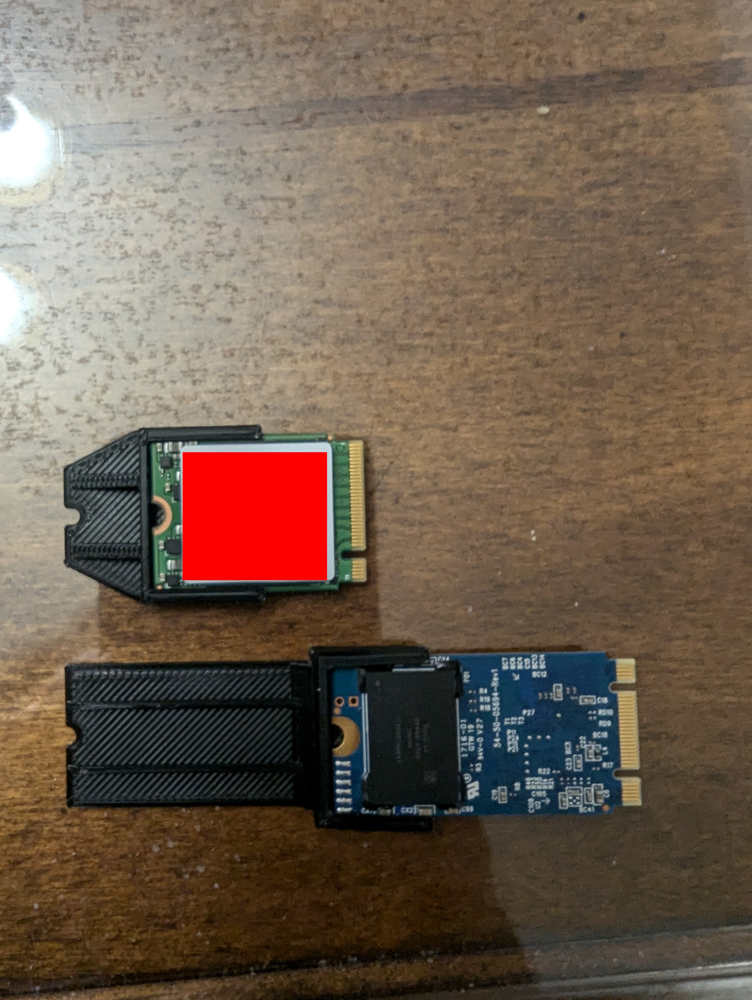

# Overview

Proxmox is a Debian based level 1 hypervisor which means it performs virtualization at the bare metal level rather than sitting on top of an existing OS. The fact that it's Debian aligns well with one of the missions at the hackerspace to promote free and open source software whenever possible, and while you can pay for enterprise support you can also just roll with a free version and add 3rd party community repositories to bolster functionality and updates.   

Some of the additional features of Proxmox include: 

- Web UI for management of the server
- Support for multiple storage solutions
- Easy to backup and restore
- Scalability
- LXC container support
- Virtual Networking
- API for future automation projects

So now that I've laid out the reasons for using Proxmox, let's talk about the specifics of what the installation at the hackerspace will look like. 

## Hardware

The hardware for our first Proxmox server will be an old HP ZBook 15 G4 laptop with a 4 core, 8 thread i7-7700HQ processor and 32GB of DDR4 SODIMM RAM. As far as storage goes, it has 3 drive slots - two NVMe and one 2.5in SATA drive bay. It's also got a dedicated graphics card that we can use for a simple AI server or light 3D modeling workloads! Running a laptop as a server has quite a few benefits (especially when said laptop was free). It's got a built in crash cart and UPS, can be easier to upgrade, and is more power efficient than running a full fat tower or rack mount server. While there's certainly an upper limit on it's ability, I like this laptop as a starter server for the hackerspace.

Interestingly enough, the hard drives I had on hand did not fit the M.2 slots that were on the laptop. I decided to use my 3D printer to print adapters for the M.2 slots which I thought was neat.

## Installation Specifics

The OS disk will be a 32GB SATA M.2 drive. Proxmox is *extremely* lightweight on it's install so 32GB is plenty. The other NVMe slot will be for VMs and containers since that will provide the most performance. The 2.5in SATA bay will host an SSD that can also be used for VMs and containers, but will primarily be for backups and ISOs. My policy on hypervisors is to keep them lean and mean so aside from the OS, I don't put much of anything else on them. That being said I do have a future project in mind to allow for remote access to the server using [Headscale](https://headscale.net/) which is an open source, self-hosted [Tailscale](https://tailscale.com/) implementation. I think a good name for the first server in the SoDak Hackerspace is `blackelk.pve.sodakhacker.space`, after one of the most interesting South Dakotans, Nicholas Black Elk. 

## Post Installation Setup

Quite a few tweaks were made to the server post install. First I ran a script that configured the community repositories. That script can be found [here](https://tteck.github.io/Proxmox/#proxmox-ve-post-install). It also got rid of the annoying activation popup so that was nice. I enabled VLAN tagging on the NIC as well in order to have better seperation between networks. After that I configured the two non-OS drives to be single BTRFS drives so snapshots could be taken. That required editing `/etc/fstab` in order to have the disks mount at boot. If I ever have to reconfigure new drives, I'll need to remove those entries. I also configured backups to run every night at midnight on the SATA 2.5in drive. Next, I configured the server to enable GPU passthrough. [A reddit post](https://www.reddit.com/r/Proxmox/comments/1f2f5zi/proxmoxenhancedconfigurationutility_pecu_automate/?share_id=r_qFqbAqEqjU0Jpq6LSpK&utm_content=2&utm_medium=android_app&utm_name=androidcss&utm_source=share&utm_term=20) was sent to me that walked through that, and there was a script you could run as well once the BIOS settings were worked out. Finally I modified the `/etc/systemd/logind.conf` to allow the laptop to be closed but still run. All I had to do was modify the `HandleLidSwitch` option to be `ignore`. 

And that was it! The hackerspace now has a working Hypervisor configured with some nice quality of life improvements! And of course, I needed to sticker bomb the latop. I am a security professional after all.

